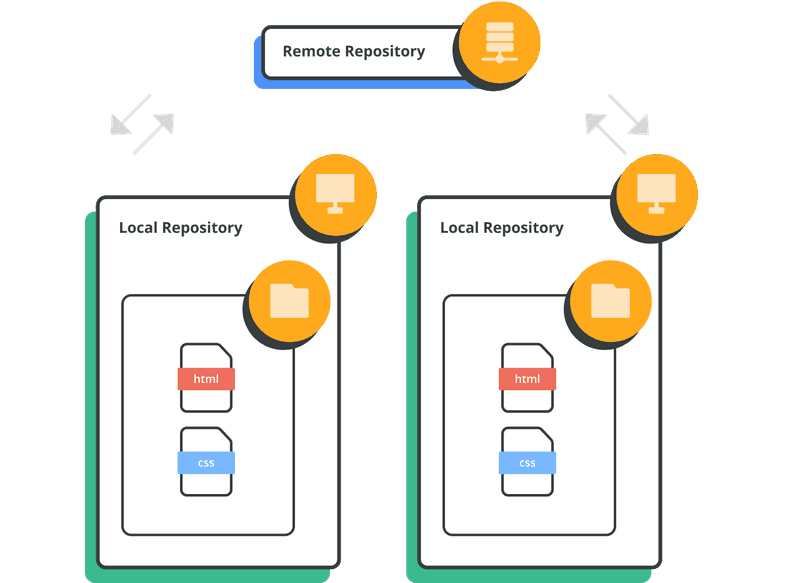
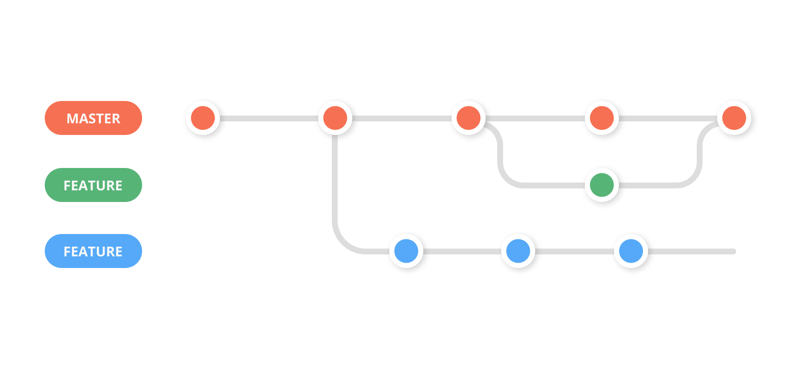
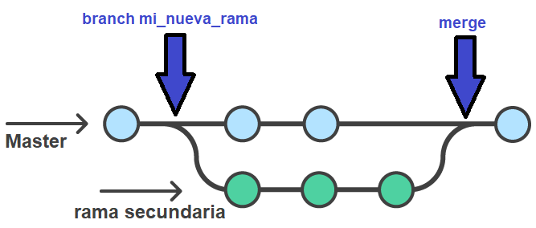
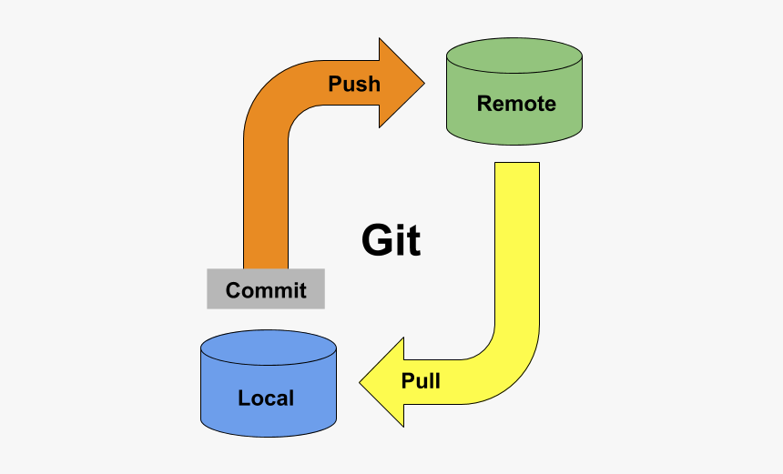

# Curso Git

✨ El principio de mi proyecto Git

  

 

 *¡Vamos con todo!*

## Clase 1: Git y Control de Versiones

### ¿Qué es un control de versiones?
Un control de versiones es un sistema que registra cada cambio que se realiza en el código fuente de un proyecto. Esto permite tener un histórico de todos los cambios, saber quién los hizo y cuándo.

### ¿Por qué es tan importante un control de versiones?
- **Rendimiento**: Solo se guarda lo necesario, optimizando el espacio.
- **Seguridad**: Conserva un registro completo de todas las acciones realizadas.
- **Flexibilidad**: No es necesario seguir un desarrollo lineal, puedes trabajar en ramas y fusionarlas cuando sea necesario.

### Un poquito de historia...
- **1990**: Nace CVS, el primer sistema de control de versiones, donde cada archivo tenía su propio número de versión.
- **2005**: Después de la caída de BitKeeper, la comunidad de desarrollo de Linux (y en particular Linus Torvalds) crea **Git**.
- **2008**: Se crea **GitHub**, desarrollado en Ruby on Rails.
- **2018**: **Microsoft compra GitHub**. Hubo cierto temor respecto a este cambio, pero GitHub sigue siendo uno de los servicios más populares.

### ¿Qué es un repositorio?
El pilar de Git son los **repositorios**. Un repositorio es una carpeta en la que se almacenan las diferentes versiones de los archivos de un proyecto y el historial de los cambios realizados en ellos. Los repositorios pueden ser:

  

- **Locales**: Están en tu ordenador.
- **Remotos**: Están en un servidor externo (como GitHub).

### Inicializar un proyecto con Git
Para empezar a usar Git en un proyecto, debes inicializarlo con el comando:
### Comandos de Git
- `git init`: Inicializa un repositorio vacío en el directorio actual.

##  Clase 2: Comandos y Ramas
En la clase 2 aprendimos los comandos mas basicos para trabajar con git y a crear, movernos entre ramas y a eliminar ramas.
### Comandos de Git
- `git add archivo.algo`: Lleva un archivo al área de *staged* (preparación).
- `git status`: Muestra el estado actual del repositorio y los archivos.
- `git commit`: Realiza un commit con los cambios agregados.
- `git commit -m "mensaje"`: Hace un commit con un mensaje descriptivo.
- `git restore --staged archivo.algo`: Quita un archivo del área *staged* (lo desprepara).
- `git add .`: Agrega todos los archivos modificados al área de *staged*.
- `git log --oneline`: Muestra el historial de commits en una sola línea por commit.
- `git help`: Muestra ayuda general o de un comando específico.
- `git commit --amend -m "nuevo mensaje"`: Reemplaza el mensaje del último commit.

### ¿Qué es el HEAD?

  

`HEAD` es un puntero que indica en qué commit estás actualmente.  
Siempre apunta al **último commit de la rama activa**.

### ¿Que son las Ramas?

  

Es un instantaneo del codigo.
A nivel tecnico es un nuevo apuntador hacia una de las confirmaciones.

### Comandos de Git para trabajar con Ramas:
- `git branch nombre`: Crea una nueva rama.
- `git switch nombre`: Cambia a una rama existente.
- `git switch -c nueva-rama`: Crea y cambia a una nueva rama.
- `git checkout nombre`: Cambia de rama (forma clásica).
- `git branch -d nombre`: Elimina una rama local (solo si ya fue fusionada).
- `git branch -D nombre`: Fuerza la eliminación de una rama local (aunque no haya sido fusionada).

## Clase 3: Merge de Ramas y Conflictos

En la clase 3 aprendimos como fusionar ramas, como solucionar conflictos y las mejores practicas para eliminar ramas.

  

### Comandos Merge de Ramas

- `git merge rama`: Fusiona la rama indicada con la rama activa.
- `git merge --no-ff rama`: Fusiona la rama indicada, pero siempre crea un commit de merge, incluso si la fusión podría hacerse de manera "fast-forward".
- `git merge --abort`: Cancela la fusión en curso y vuelve al estado anterior.

### ¿Qué es Fast Forward?
El **fast-forward** ocurre cuando la rama en la que estás no tiene cambios que se aparten de la rama que estás fusionando. En este caso, Git solo mueve el puntero de la rama actual al ultimo commit de la rama fusionada, sin crear un commit adicional.

### Eliminar Ramas: ¿Por qué es importante?
Eliminar ramas es una buena práctica. Las ramas deben crearse con un propósito específico y de corto plazo. Después de fusionarlas, eliminar las ramas innecesarias mantiene el repositorio limpio y organizado.

### Comandos para Eliminar Ramas
- `git branch -d <nombre>`: Elimina una rama **solo si ha sido fusionada** con la rama actual. Es una forma segura de borrar ramas.
- `git branch -D <nombre>`: Elimina una rama **forzadamente**, incluso si **no ha sido fusionada**.

### Conflictos en Git

  

Cuando Git no puede fusionar automáticamente dos ramas debido a cambios contradictorios, se produce un **conflicto**. Para resolverlo, puedes usar:

- `git diff`: Muestra las diferencias entre las ramas, lo que te ayudará a identificar el conflicto y solucionarlo manualmente si no estas usando Visual Studio Code.

## Clase 4: Git y GitHub

  

### Git
Git es un sistema de control de versiones que permite gestionar el historial de cambios de un proyecto, nos facilita el trabajo en equipo y el manejo de versiones de manera eficiente.

### GitHub
GitHub es un servicio de alojamiento en la nube para proyectos de código fuente, que permite almacenar y gestionar repositorios Git de manera remota.

### Comandos de Git

- `git remote add origin url`: Conecta tu repositorio local a un repositorio remoto en GitHub.
- `git remote prune origin`: Elimina las referencias a ramas remotas que ya no existen en el repositorio remoto.
- `git clone url`: Clona un repositorio remoto a tu máquina local.
- `git branch -a`: Muestra todas las ramas locales y remotas, usando diferentes colores para diferenciar.

### Ramas Remotas

Las ramas remotas son las versiones de las ramas que están en el repositorio remoto. 
- `git remote -v`: Muestra las URLs de los remotos configurados.

### Git Push y Git Pull

  

#### Diferencia entre `git push` y `git pull`

- **`git push`**: Sube los cambios desde tu repositorio local hacia el repositorio remoto.
  - `git push`: Sube los cambios de la rama activa.
  - `git push --all`: Sube todas las ramas locales.
  - `git push -u origin rama`: Establece la rama remota de seguimiento para la rama local.
  - `git push -d origin rama`: Elimina una rama remota.
  - `git push -f`: Fuerza la subida de cambios, sobrescribiendo cambios remotos.

- **`git pull`**: Trae los cambios del repositorio remoto hacia tu repositorio local.
  - `git pull`: Hace un fetch seguido de un merge.
  - `git fetch`: Obtiene los cambios remotos sin hacer merge.
  - `git pull origin rama`: Trae cambios de una rama remota específica.
  - `git pull --all`: Trae los cambios de todas las ramas remotas.

#### Diferencias entre `git pull` y `git fetch`
- `git fetch` solo descarga los cambios del repositorio remoto sin integrarlos en tu rama local.
- `git pull` descarga los cambios y los fusiona automáticamente en tu rama local.

### Pull Request (PR)

#### ¿Qué es un Pull Request?

  

Un *pull request* (PR) es una solicitud para que los cambios hechos en una rama sean revisados y fusionados en el repositorio original. Es una manera de colaborar y contribuir en proyectos.

#### ¿Cómo hacer un Pull Request?
1. Sube tu rama al repositorio remoto con `git push`.
2. Luego, tienes dos maneras de crear un PR:
   - Si la rama fue subida recientemente, GitHub te mostrará una opción para crear el PR en la página del repositorio.
   - O, puedes ir al apartado de *Pull Requests* en GitHub y crear uno manualmente.

#### Hacer una buena Pull Request
- Enfoca tu PR en **una sola cosa**. Es más fácil de revisar y aceptar un PR que hace algo específico que uno que modifica varias cosas a la vez.
- Explica claramente el propósito del PR.
- Revisa tu código antes de enviar el PR para asegurarte de que está limpio y bien documentado.

### Fork(Adicional)

Un *fork* es una copia de un repositorio en tu cuenta de GitHub. Se utiliza para hacer cambios sin afectar el repositorio original, y es comúnmente utilizado para contribuir a proyectos de código abierto.